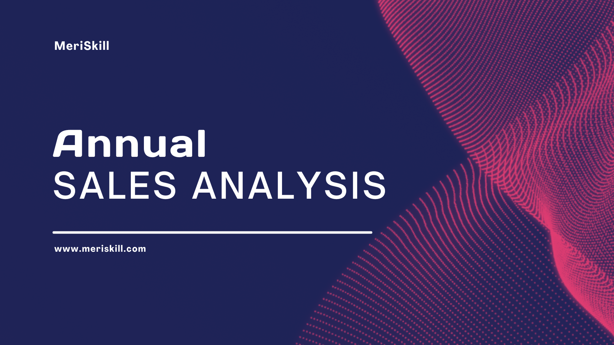
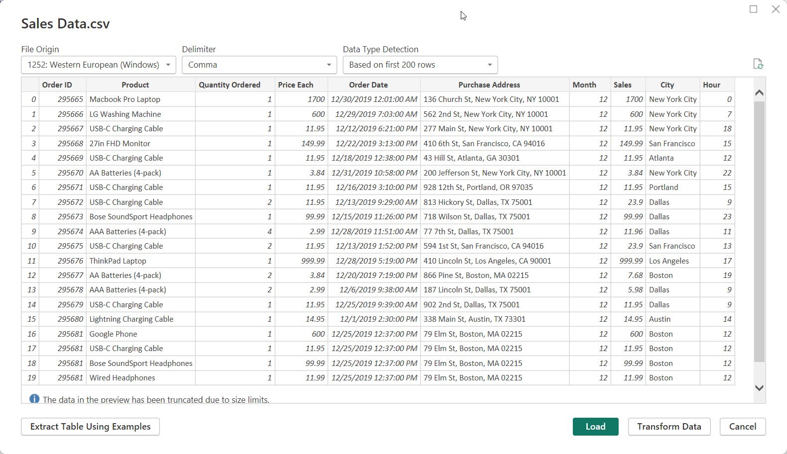
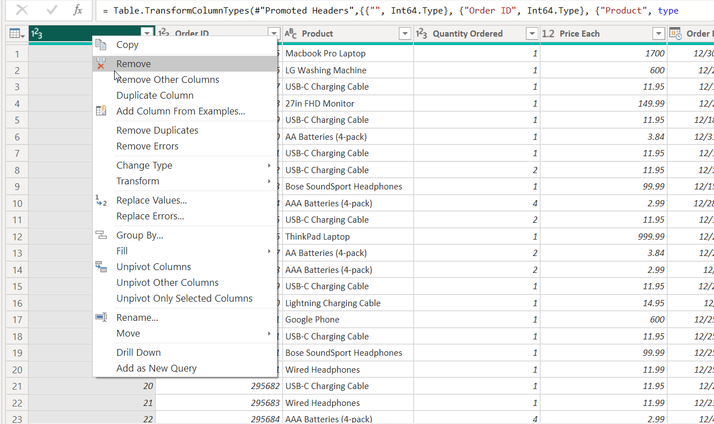
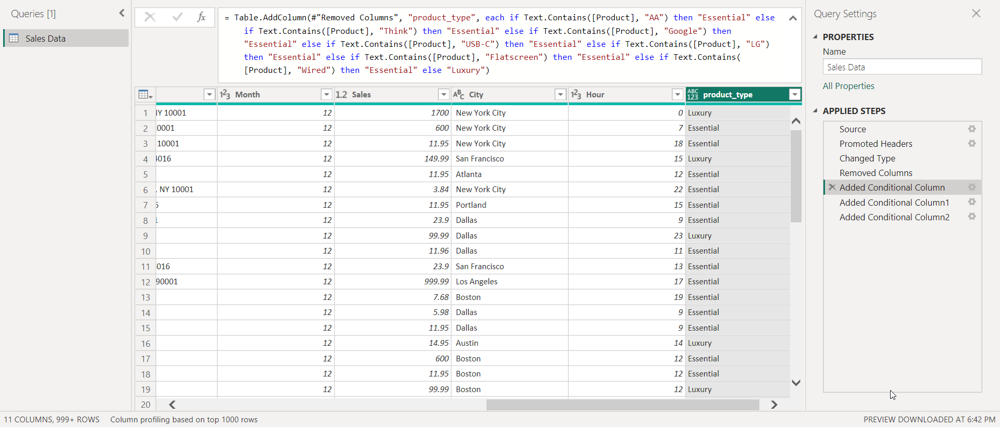
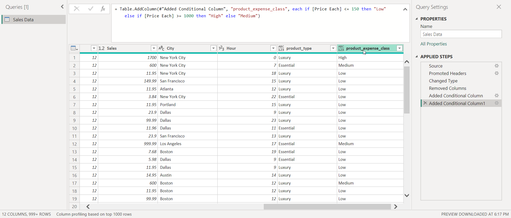
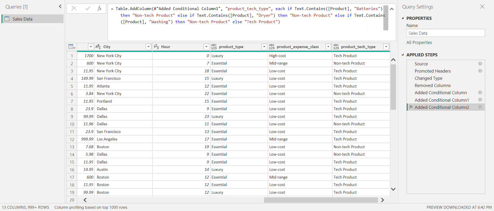
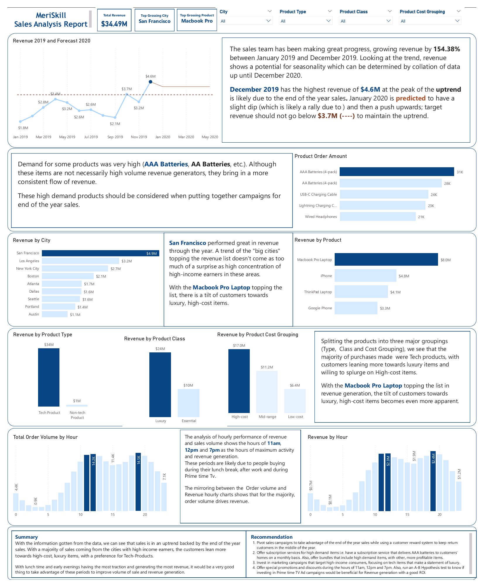

# Project 1 - Sales analysis Analysis

## Introduction

In a bid to have an edge in the market and understand what really turns the wheels in revenue, businesses have started to turn to data to get unbiased and reliable insights on their sales.

This report presents the findings of a sales analysis that was conducted to identify areas where the company's sales team can improve revenue generation.

**_Note:_** _The dataset used here was provided by **MeriSkill** as part of my internship projects._
## Problem Statement

Having a need to plan better for the new year (2020), they needed insights that would help them:
1. Identify trends
2. Identify the top selling products
3. View revenue metrics
All these, with the aim of improving sales in the coming year.

## Skills/Concepts Demonstrated

In the course of this project, I was able to incorporate the following Power BI features:
- DAX
- Conditional Columns
- Filters
- Data transformation

## Modelling

As this was a one-table dataset, there was no need for modelling to be carried out explicitly.

## Transformation

To get the data analysis ready, the first field (which was not needed) was dropped.

Also, data was grouped, to enhance analysis, into the following:
1. Product class type
	1. Luxury
	2. Essential
2. Product cost/expense
	1. High (High-cost)
	2. Medium (Mid-range)
	3. Low (Low-cost)
3. Product Tech type
	1. Tech product
	2. Non-Tech product
These grouping will serve as classifications of products to make analysis easier.

## Visualisation

A single page visualisation and report was generated as a result of the analysis.

## Analysis

### Main Dashboard

#### Revenue
In the course of one year, the company generated **$34.49 million** in revenue, showing a growth of **154.38%** between January 2019 and December 2019. Although the data for  January 2020 is included in the data set, it was not included in the analysis as data collected stopped on the first day of January 2020.

The mid spring to the end of summer saw a drop in revenue, which is likely due to the summer holidays and preparation towards it. December 2019 generated the highest revenue (**$4.6 million**).

This flow of data shows a high potential of a slight dip before a rebound in revenue.

#### Does More Quantity Actually mean More Revenue?
AAA batteries and AA batteries sold off the most but still generated the least Revenue, this reality would leave anyone perplexed. ☹️

Digging a little deeper, we realise that this pattern was due to the fact that these high demand items are actually the lesser expensive which made their revenue generation rate very slow. The demand on these items is likely due to the fact that they have relatively shorter life spans but are too important to be abandoned completely. This would play a vital role when creating marketing campaigns to boost revenue.

#### Cities and Products
San Francisco made **$4.5 million** in revenue, with Los Angeles (**$3.2 million**) and New York City (**$2.7 million**) coming in close behind. The buying power of these states is very likely due to high income workers in these cities.
Also, the MacBook Pro Laptop outsold its counterparts with **$8 million** in revenue. With iPhone, ThinkPad Laptops and Google phone being the top four, a clear indication that two things are paramount on the minds of the top buyers:
- Luxury or items if class and
- Essential or necessary items
With their high income position, these customers are able to acquire high cost items.

Looking at customer spending habits, we can see that Tech products, Luxury products and High-Cost products are their favourites which once again, buttresses the reality of their high income.

#### When is Sales Rush Hour?
Knowing when your customers tend to buy helps in determining the best time for "put the product in from them."

Customers tend to acquire products during that peak of their "waking hour". This is noted with the increase in activity between 11am and 7pm. As usual, the activity of the customers is during their lunch break (11am - 12pm) and their "kick back" period (7pm) of watching Prime time TV after a long day at work, the true definition of Netflix and chill.

## Conclusion and Recommendations

With the data at hand, it's clear that the company's revenue was largely driven by tech products, which accounted for over **98%** of total annual revenue. Luxury items also proved popular among customers, generating nearly **70%** of the company's total revenue. All of these figures, combined with the sizable amount spent on high-cost items, point to the fact that the majority of the company's customers are likely high-income earners, 

Harnessing all of these, it would be wise to consider the following recommendations.
### Recommendations
1. Setup campaigns that would target the end of the year boost in sales and also create a reward system that keeps customers active through the low points, middle of the year. This could be in the form of a 5% discount for sales in the middle of the year that exceed a specific amount.
2. Subscription services should be offered for high demand-low income items, such as a subscription service that delivers AAA batteries to the customer's house monthly or bi-monthly.
3. Marketing campaigns for high-income customers with a high value for luxury and tech products that focus on the exclusivity, value of the products, innovation and quality should be used to draw in more customers.
4. Strike when the iron is hot! Schedule your product launches for the peak sales hours starting 11am to 8pm, when customers are most likely to be shopping. Through these period, 11am through to 1pm and 7pm through to 8pm see the most activities; including a discount for items bought within these periods can also boost sales.
